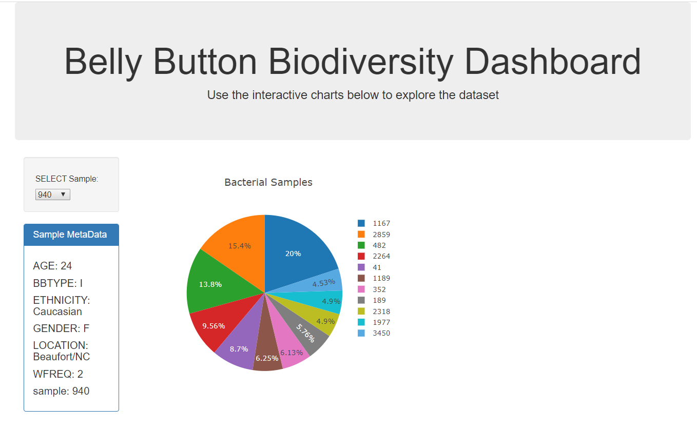

# Plot.ly - Belly Button Biodiversity

Dashboard Visualization that uses Plotly to display biodiversity samples in an interactive Pie chart and Bubble Chart. Deployed to Heroku - visuals provided below for the interactive dashboard. 

